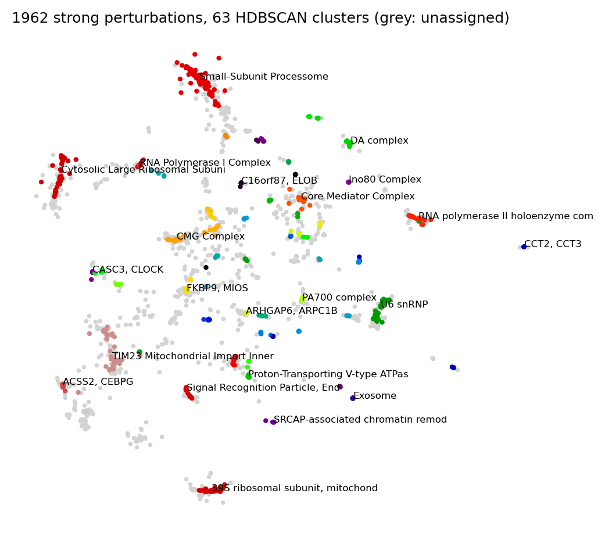
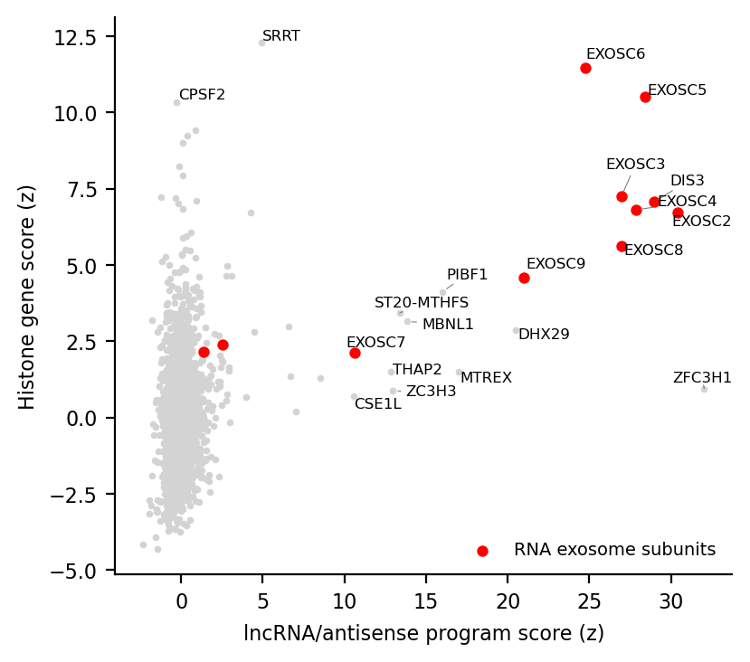

# Genome-Scale Perturb-seq Replication

A replication of the main analyses of Replogle et al., "Mapping information-rich genotype-phenotype landscapes
with genome-scale Perturb-seq", *Cell* 185:2559-2575 (2022), [doi:10.1016/j.cell.2022.05.013](https://doi.org/10.1016/j.cell.2022.05.013),
using the public pseudobulk data (K562 genome-wide, K562 essential and RPE1 essential CRISPRi screens), plus
one extension on the RNA exosome.

The write-up is in [`report/report.md`](report/report.md) ([PDF](report/report.pdf)). Problems found in an earlier
version of this repository, and how fixing them changed the results, are listed in [`BUGFIX.md`](BUGFIX.md).

## Main results

| Analysis (paper figure) | This replication | Paper |
|---|---|---|
| Strong perturbations, K562 genome-wide (S2) | 1,962 | 1,973 |
| Median r, same CORUM complex vs other pairs (2B) | 0.60 vs 0.10 | 0.61 vs 0.10 |
| Perturbation clusters (2D) | 63 | 63-64 |
| Agreement of perturbation correlations, K562 day 6 vs day 8 / K562 vs RPE1 (S4) | r = 0.83 / 0.33 | 0.82 / 0.37 |
| Gene expression programs (4B) | 39 | 38 |
| Integrator module INTS10/13/14 + C7orf26, within vs between r (3B, K562) | 0.74 vs 0.10 | qualitative |
| TMEM242 vs ATP synthase / complex I on mtDNA genes, K562 (7D) | r = 0.90 / 0.46 | qualitative |

Extension: knockdown of RNA exosome subunits raises both replication-dependent histone transcripts and a
program of lncRNA/antisense transcripts (median z 6.7 and 27.0 vs about 0 for other perturbations).

<p align="center"> </p>

## Layout

```
src/gwps.py      shared functions: loading, strong/weak classification, profiles, gene selection, MDE, enrichment
notebooks/       one notebook per analysis, run in order (later notebooks read results/ of earlier ones)
  01_qc_strong_weak             Fig. S2F, G, I, J
  02_perturbation_similarity    Fig. 2B, 2D (CORUM, HDBSCAN, MDE)
  03_cross_dataset              Fig. S4A-F
  04_integrator                 Fig. 3B
  05_expression_programs        Fig. 4B-D
  06_mitochondria               Fig. 6, S8, 7D
  07_exosome_histone_lncrna     extension
figures/         figures written by the notebooks
results/         intermediate tables (classes, clusters, selected genes, programs, scores)
report/          report (Markdown and PDF)
scripts/         download_data.sh
```

## Running

```bash
conda env create -f environment.yml && conda activate gwps-replication
scripts/download_data.sh          # about 0.6 GB into data/
cd notebooks
for nb in 0*.ipynb; do jupyter nbconvert --to notebook --execute --inplace "$nb"; done
```

The full run takes about 3 minutes on 16 CPU cores and needs less than 4 GB of memory. Enrichment analyses
download Enrichr libraries, so an internet connection is required.

## Differences from the paper

- Per-gene Anderson-Darling statistics are not public, so the 2,319 genes used for clustering are approximated
  (`gwps.select_genes`, 2,273 genes).
- CORUM 3.0 and MitoCarta3.0 could not be downloaded; the Enrichr CORUM library and GO cellular-component terms
  are used instead. Fewer complexes (174 vs 327) and fewer mitochondrial perturbations (227 vs 268) result.
- Fig. S4A/C compares the two sets of pairwise correlations with Pearson's r; the paper reports a cophenetic
  correlation.
