# I. Research background

The relationship between genotype and phenotype is a central question in genetics. Classical approaches each have limitations: forward genetics relies on low-dimensional phenotypic screens, and reverse genetics is difficult to apply systematically at genome scale.

Replogle et al. (2022) combined CRISPR interference with single-cell RNA sequencing (Perturb-seq) to measure, in the same cell, which gene was knocked down and how the whole transcriptome responded. Applied to every expressed gene, this gives a high-dimensional phenotype for each genetic perturbation and makes it possible to build a comprehensive genotype-phenotype map. This report reproduces the main analyses of that study and adds one new observation.

# II. Data sources

Three datasets were downloaded from the resource provided with the paper (https://gwps.wi.mit.edu/):

- `K562_essential_normalized_bulk_01.h5ad`
- `K562_gwps_normalized_bulk_01.h5ad`
- `rpe1_normalized_bulk_01.h5ad`

They contain CRISPRi screens in two cell lines: in K562, a genome-wide screen and a screen of essential genes; in RPE1, a screen of essential genes only. As described in the paper's methods, the data had already been aligned, UMI-collapsed, assigned to sgRNAs, aggregated per perturbation (pseudobulk), z-normalized to non-targeting control cells, and tested for transcriptional changes with energy-distance and Anderson-Darling tests.

All code is in the repository (`src/gwps.py` and `notebooks/`). An earlier version of this analysis contained several errors; they are listed, with their effect on each result, in `BUGFIX.md`. The figures shown here are the corrected versions. Figures of the original paper are referred to as "paper Fig." and are not reproduced here.

# III. Replication of the paper

## 1. Quality control and selection of strong perturbations

We first selected well-measured perturbations with effective knockdown and then separated strong from weak perturbations, using the criteria in the paper's methods:

- **Effective knockdown:** expression of the target reduced by at least 30% relative to control cells, or the target not detected; and at least 25 cells passing quality control.
- **Strong perturbation:** at least 50 genes significantly changed relative to control (Anderson-Darling test, Benjamini-Hochberg adjusted p < 0.05).
- **Weak perturbation:** fewer than 5 significantly changed genes.

<figure>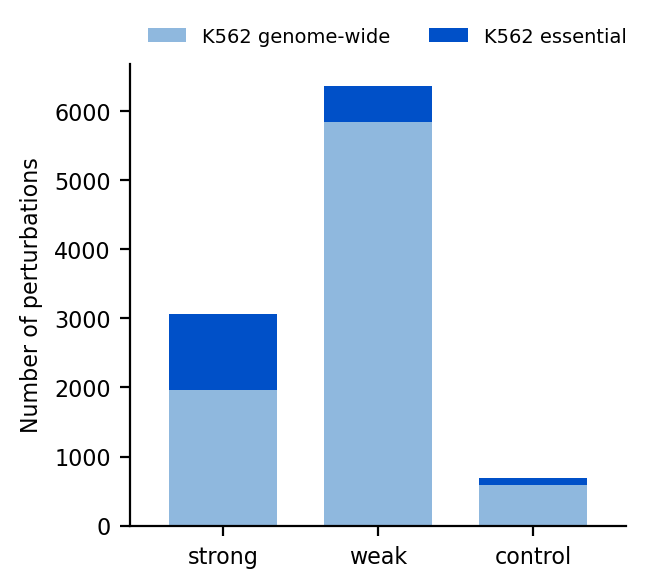 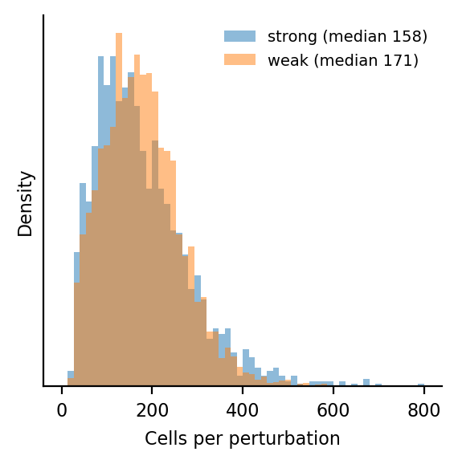 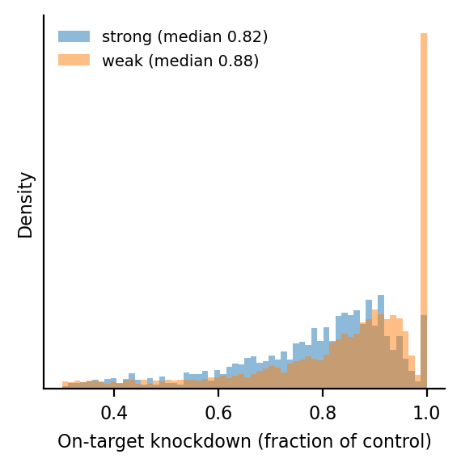<figcaption>Fig. 1. Quality control and selection of strong perturbations. Left (cf. paper Fig. S2G): number of strong and weak perturbations and of non-targeting controls in the K562 essential and genome-wide screens. Middle (cf. paper Fig. S2I): number of cells per perturbation. Right (cf. paper Fig. S2J): knockdown of the target relative to control cells.</figcaption></figure>

We identified 1,962 strong perturbations in the K562 genome-wide screen, close to the 1,973 reported in the paper, and 1,101 in the K562 essential screen. To check that the strength of a perturbation reflects its biology rather than how well it was measured, the paper compared the number of cells and the knockdown of strong and weak perturbations (Fig. 1). As in the paper, the two groups are similar: the median number of cells is 158 for strong and 171 for weak perturbations, and the median knockdown is 82% and 88%. Weaker phenotypes are therefore not explained by fewer cells or poorer knockdown.

We then used KEGG enrichment to compare the genes behind strong and weak perturbations (Fig. 2), testing against all genes targeted in the screen. As in the paper, strong perturbations are concentrated in RNA-related processes: the ribosome (adjusted p = 2e-57), ribosome biogenesis, RNA transport and the spliceosome. Weak perturbations show no enrichment for a core cellular process. Their only strong term, "Herpes simplex virus 1 infection", consists mostly of KRAB zinc-finger genes (273 of 337 genes), which are largely not expressed in K562, so knocking them down has no effect.

<figure>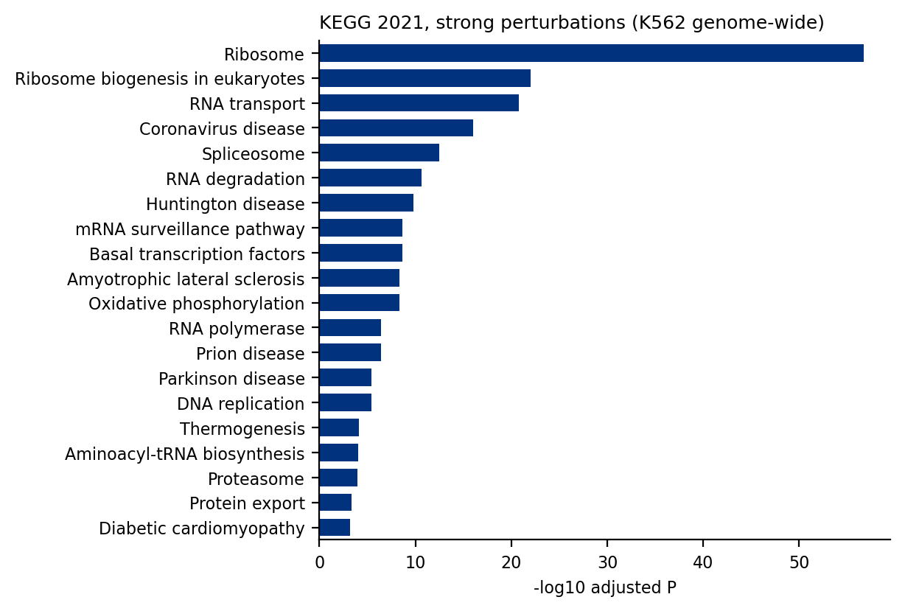 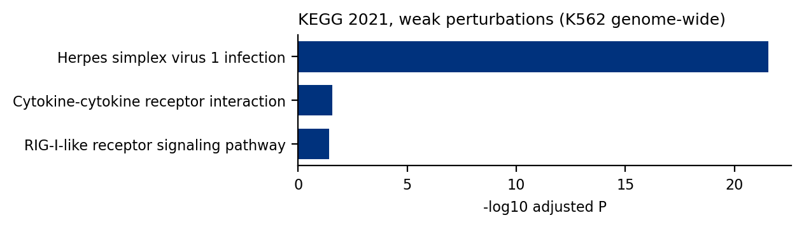<figcaption>Fig. 2 (cf. paper Fig. S2F). KEGG pathways enriched among strong (top) and weak (bottom) perturbations in the K562 genome-wide screen; background, all targeted genes.</figcaption></figure>

## 2. Defining gene function with Perturb-seq

Most genes are expressed at low levels, so the analysis of gene function was restricted to well-expressed, variable genes. Following the paper, we took the union of the most strongly changed genes of each strong perturbation and the 30% most variable genes among those with more than 0.25 UMI per cell, which gives 2,273 genes (paper: 2,319; Fig. 3 left). Because related perturbations can differ in the size of their effect, the paper used the correlation between pairs of perturbations, which does not depend on effect size, as the measure of similarity. We computed this correlation matrix for the 1,962 strong perturbations in the same way, with the target gene of each perturbation set to zero (Fig. 3 middle).

To confirm that correlated perturbations reflect shared gene function, the paper used CORUM, a manually curated database of mammalian protein complexes in which every entry is supported by experimental evidence. Among the strong perturbations, 3,624 pairs of perturbations target subunits of the same complex (174 complexes). Their correlation (median 0.60) is much higher than that of all other pairs (median 0.10; one-sided Mann-Whitney p < 1e-300; Fig. 3 right), matching the values in the paper (0.61 and 0.10). Fewer complexes are represented than in the paper (327) because the CORUM release used here, distributed through Enrichr, is smaller than CORUM 3.0.

<figure>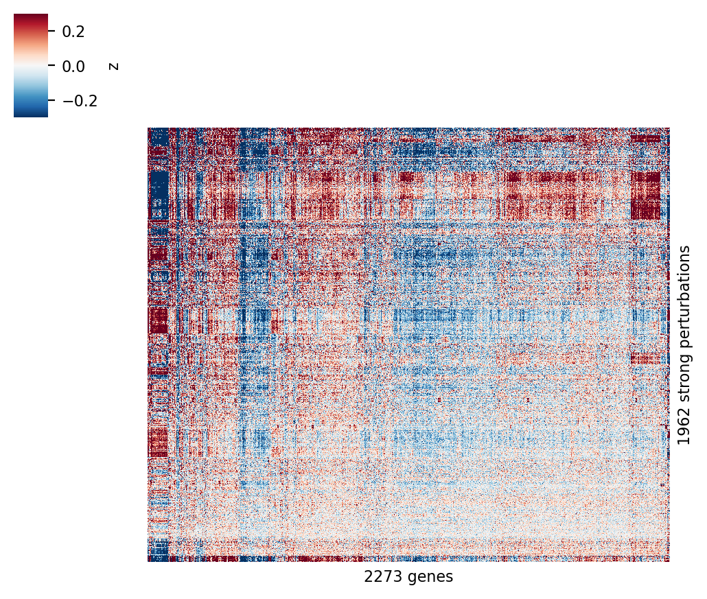 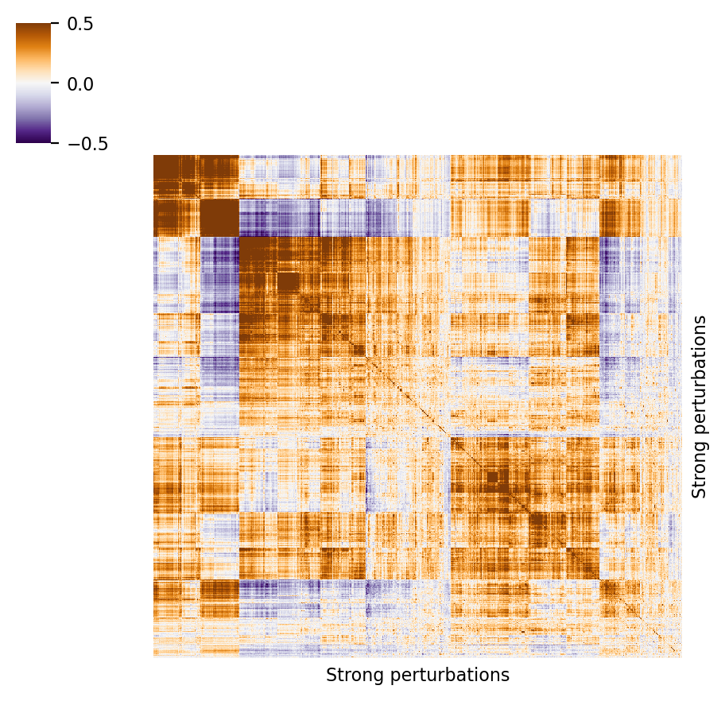 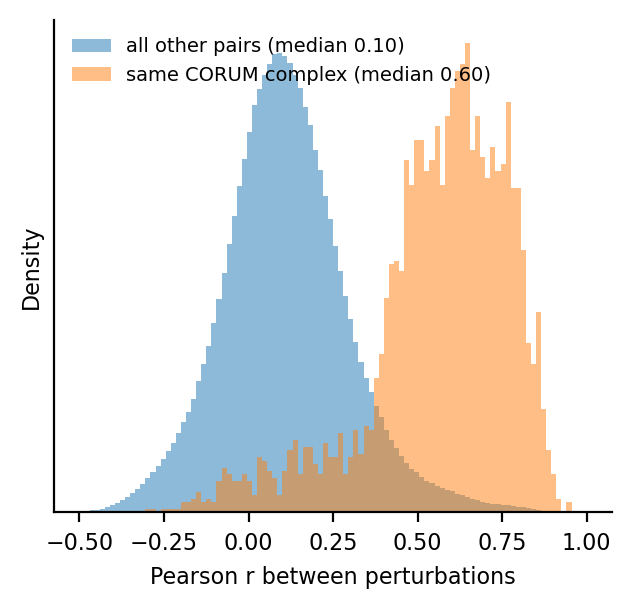<figcaption>Fig. 3. Correlation between perturbations. Left (cf. paper Fig. 2A): expression of 2,273 genes in the 1,962 strong perturbations, both clustered. Middle: correlation matrix of the strong perturbations. Right (cf. paper Fig. 2B): correlation between perturbations of subunits of the same CORUM complex and between all other pairs.</figcaption></figure>

We next clustered the perturbations with HDBSCAN on correlation distances, using the parameters given in the paper (`min_cluster_size = 4`, `min_samples = 1`). This gives 63 clusters, in line with the paper (63 clusters in the methods, 64 in the text); 64% of the strong perturbations are not assigned to any cluster. We visualised the perturbations with minimum-distortion embedding (MDE), colouring each cluster (Fig. 4). The paper annotated all clusters by hand; here, clusters with at least 8 members are labelled with the complex (GO cellular component or CORUM) that best matches their members. The labelled clusters correspond to known machines: the large subunit of the cytosolic ribosome, the mitochondrial ribosome, the small-subunit processome, RNA polymerase I, the U6 snRNP of the spliceosome, Mediator, the proteasome, the CMG helicase, the exosome, the INO80 and SRCAP chromatin remodellers and the V-type ATPase.

{width=70%}

## 3. Comparing perturbations between datasets

We then compared perturbations across the three datasets, using the 1,205 perturbations that change more than 10 genes in all three (paper: 1,206) and the same 1,066 well-expressed, variable genes in each dataset. The correlations between pairs of perturbations agree well between the two K562 screens (Fig. 5 left, r = 0.83; paper 0.82) and less well between cell lines (Fig. 5 middle, r = 0.33; paper 0.37). The same holds for individual perturbations: the profile of a perturbation correlates with itself between the two K562 screens with a median r of 0.60, and between K562 and RPE1 with a median r of 0.33 (Fig. 5 right; paper 0.50 and 0.23).

<figure>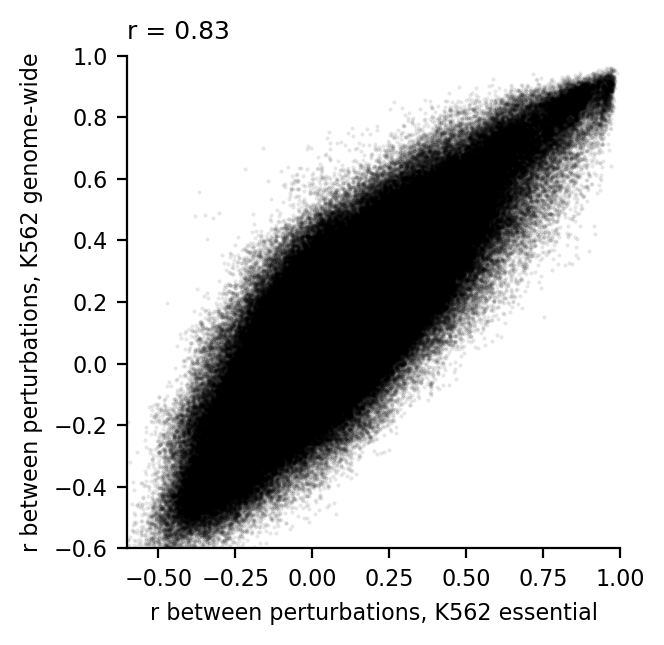 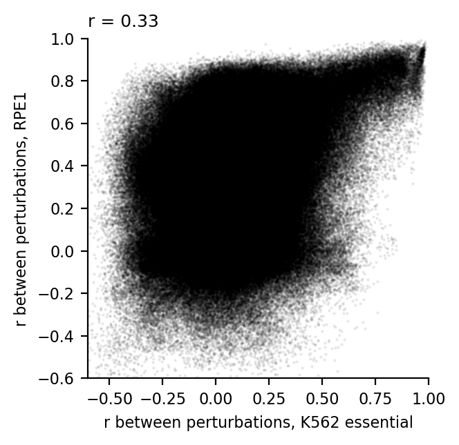 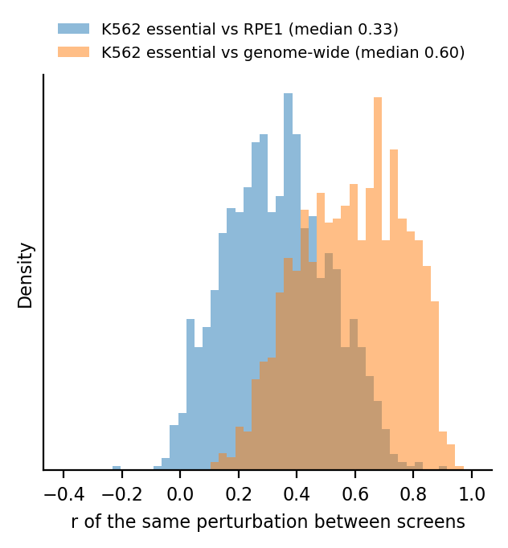<figcaption>Fig. 5. Similarity between datasets. Left (cf. paper Fig. S4A): correlation between pairs of perturbations in K562 essential and K562 genome-wide. Middle (cf. paper Fig. S4C): the same for K562 essential and RPE1. Right (cf. paper Fig. S4B): correlation of each perturbation with itself between datasets.</figcaption></figure>

We then asked which perturbations behave alike in both cell lines (Fig. 6). The 250 perturbations with r > 0.5 between K562 and RPE1 are enriched for RNA-related processes, the spliceosome and RNA transport. The 19 perturbations with r < 0 are enriched for ribosome biogenesis; they include subunits of RNase MRP/P (POP1, RPP38, RPP40) and of the small-subunit processome (UTP3, UTP6, PWP2). The earlier version of this analysis found no clear function for this group; with the corrected comparison, it points to a cell-type-specific response to defects in rRNA processing.

<figure>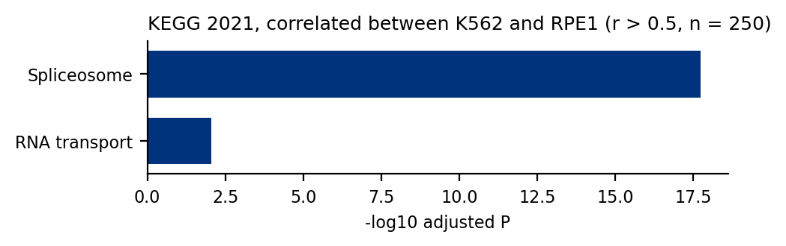 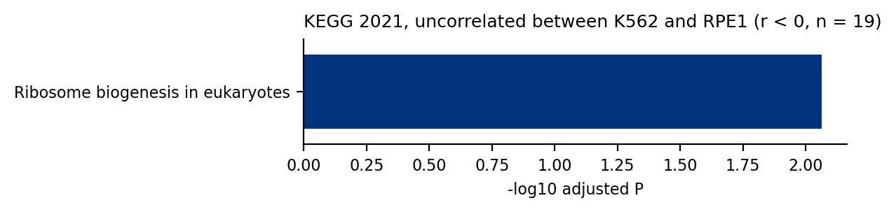<figcaption>Fig. 6 (cf. paper Fig. S4D, S4E). KEGG pathways enriched among perturbations that are well correlated (r > 0.5, top) or uncorrelated (r < 0, bottom) between K562 essential and RPE1; background, all perturbations compared.</figcaption></figure>

## 4. Annotating genes of unknown function with Perturb-seq

The paper points out that many genes of unknown function have perturbation profiles that are highly correlated with those of genes of known function. It shows several such genes that correlate with ribosomal protein genes and, by measuring the ratio of 28S to 18S rRNA, argues that they are unrecognised components or assembly factors of the ribosome. We made a correlation heatmap of the strong perturbations of the genes shown in the paper (Fig. 7). Consistent with the paper, the small-subunit (RPS) and large-subunit (RPL) groups separate, each together with its biogenesis factors and the poorly characterised genes assigned to it (for example C12orf45/NOPCHAP1 and ZNF236 with the small subunit, CCDC86 with the large subunit), and correlations within each group are high. A third, smaller group contains CINP, LAS1L and TMA16. C1orf131, SPATA5L1, SPOUT1 and UTP11 have no strong perturbation in the essential screen and are not shown.

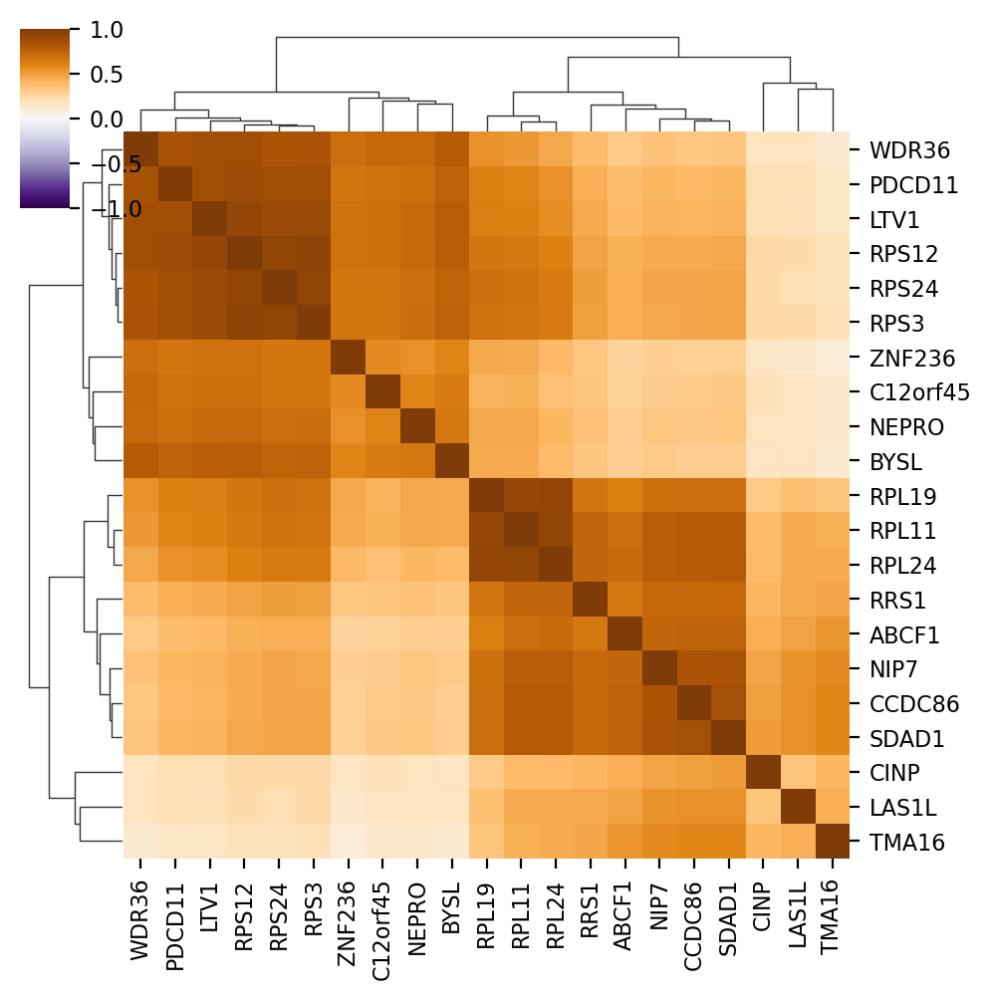{width=55%}

## 5. Discovery of a new component of the Integrator complex

<figure>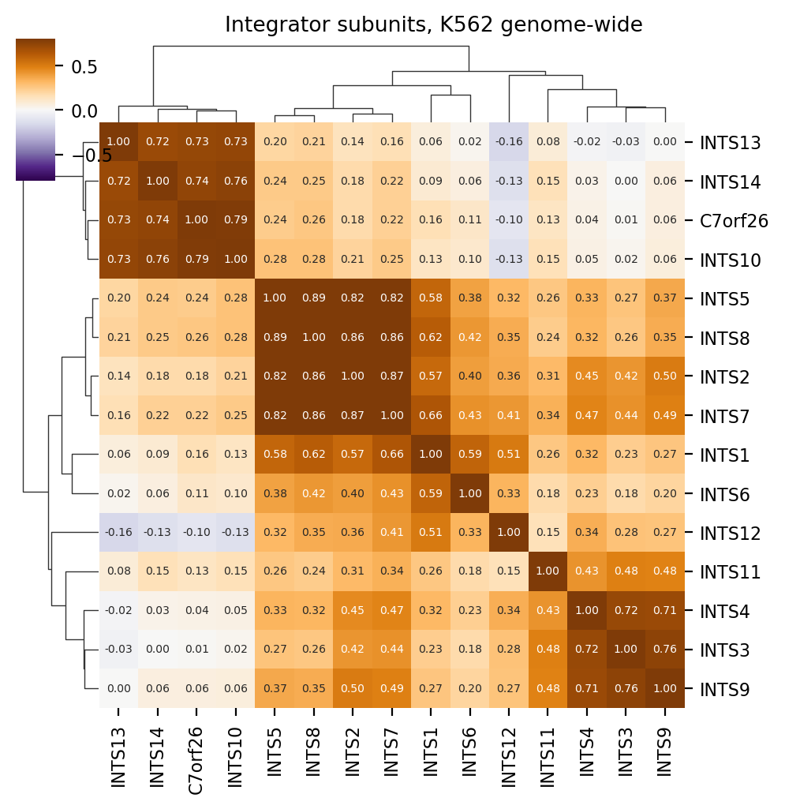 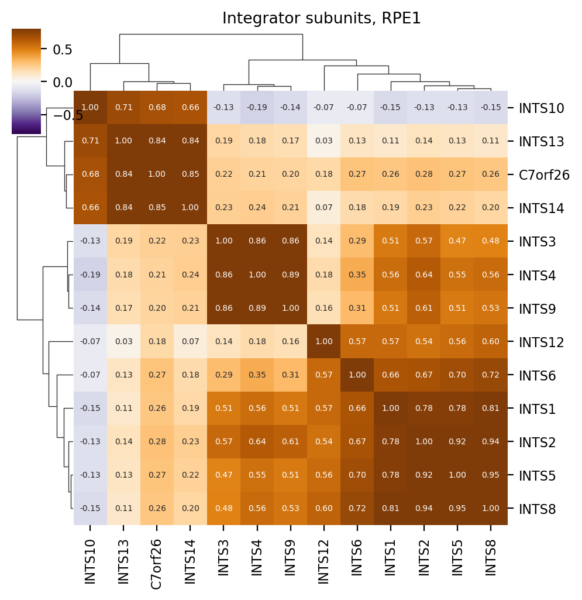<figcaption>Fig. 8 (cf. paper Fig. 3B). Pearson correlation between perturbations of Integrator subunits and C7orf26 in K562 (left) and RPE1 (right).</figcaption></figure>

Following the paper, we plotted the correlations between perturbations of the Integrator subunits and C7orf26 (Fig. 8). The subunits fall into the three modules described in the paper: INTS1/2/5/7/8, INTS3/4/9/11, and INTS10/13/14 together with C7orf26. In K562 the mean correlation within the C7orf26 module is 0.74, against 0.10 with the other subunits; in RPE1 it is 0.76 against 0.11 (INTS7 and INTS11 are not in the RPE1 screen). C7orf26 thus forms a stable module with INTS10, INTS13 and INTS14, suggesting that these four proteins act together. The paper went on to show by immunoprecipitation that C7orf26 is a new subunit of the Integrator complex (now named INTS15), illustrating how Perturb-seq can assign function to uncharacterised genes.

## 6. Construction of the genotype-phenotype map

Following the paper, genes were grouped into expression programs by their response across the 1,962 strong perturbations: each gene's profile was standardised, embedded in 20 dimensions with MDE, and clustered with HDBSCAN using the paper's parameters. This yields 39 gene expression programs (paper: 38), and 51% of the 2,273 genes are not assigned to a program (Fig. 9). The paper also reports that many genes fall outside the programs.

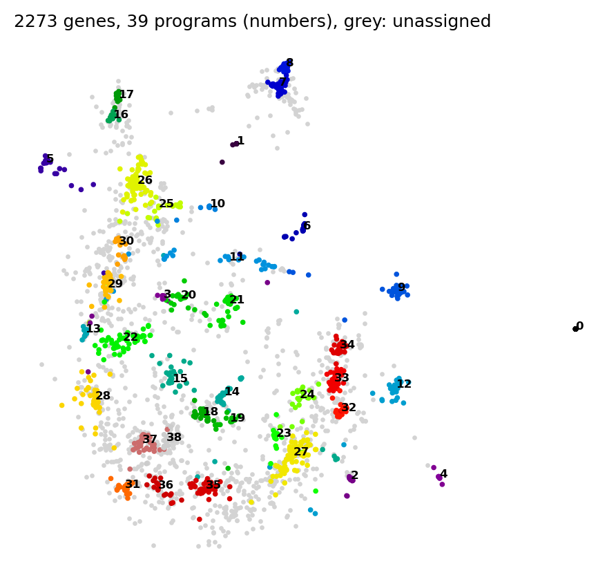{width=60%}

After removing unassigned perturbations and genes, we averaged the expression of each program within each of the 63 perturbation clusters from section 2, giving a matrix of perturbation clusters by gene expression programs (Fig. 10). Rows and columns were clustered hierarchically. Clusters of related machines lie next to each other and share programs: for example, the clusters of the cytosolic ribosome (60S subunit), the small-subunit processome and RNA polymerase I group together, as do those of Mediator, Integrator and cohesin, which are linked to transcription.

{width=75%}

## 7. Transcriptional programs and differentiation phenotypes

<figure>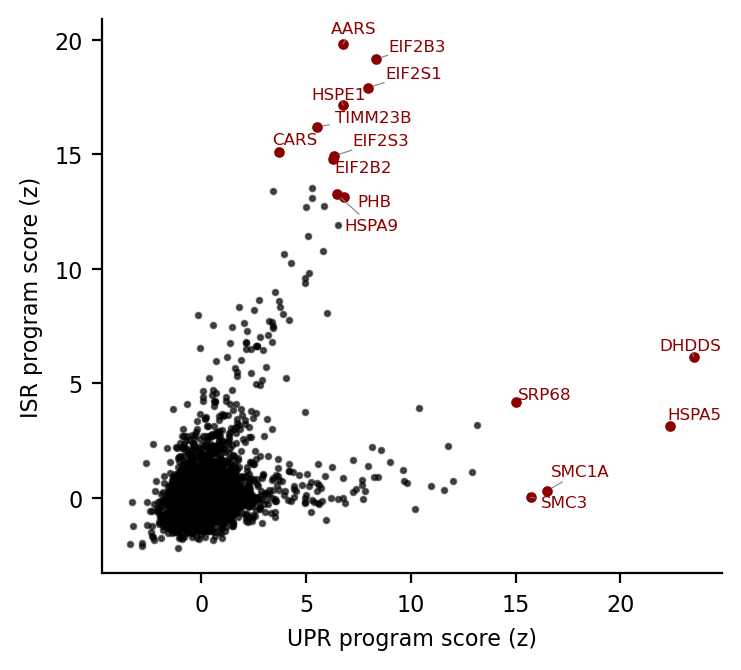 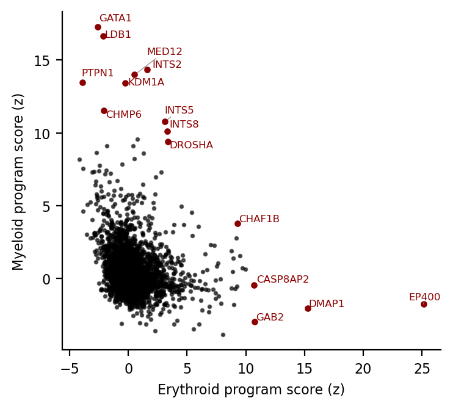<figcaption>Fig. 11 (cf. paper Fig. 4C, 4D). Left: integrated stress response (ISR) against unfolded protein response (UPR) scores for all perturbations. Right: erythroid against myeloid differentiation scores. The 15 perturbations furthest from the origin are labelled.</figcaption></figure>

The paper uses four gene expression programs to measure the integrated stress response (ISR), the unfolded protein response (UPR), and erythroid and myeloid differentiation. We took each as the program from section 6 that best matches known marker genes. The UPR, erythroid and myeloid programs share 26 of 28, 27 of 29 and 39 of 42 genes with the gene lists used in the earlier version of this analysis; the ISR program shares 7 of 17. As in the paper, a score for each program was computed for all 10,511 perturbations measured in at least 25 cells, as the mean z-normalized expression of the program genes, and the scores were z-normalized across perturbations (Fig. 11).

ISR and UPR scores are only moderately correlated (r = 0.40), and most perturbations that raise one score do not raise the other. The highest UPR scores come from knockdown of endoplasmic reticulum genes: the chaperone HSPA5 (BiP), the oligosaccharyltransferase subunit DAD1, DHDDS, and the signal recognition particle (SRP68, SRP72). The highest ISR scores come from knockdown of aminoacyl-tRNA synthetases (AARS, CARS) and of eIF2 and eIF2B subunits, the classical triggers of the ISR, and of mitochondrial import and chaperone genes (TIMM23B, HSPE1, HSPA9). Most perturbations lie near the origin; only perturbations of specific genes trigger these stress responses.

Erythroid and myeloid scores are weakly anti-correlated (r = -0.14) and separate perturbations in two directions, reflecting the ability of K562 cells to shift between lineages. The highest myeloid scores come from knockdown of positive regulators of erythroid differentiation, the transcription factors GATA1 and LDB1 and the Mediator subunit MED12, whose loss shifts cells towards a myeloid state, as described in the paper. The highest erythroid scores come from knockdown of NuA4 subunits (EP400, DMAP1). Again, most perturbations lie near the origin, so only knockdown of key lineage regulators changes the differentiation state.

## 8. Stress-specific regulation of the mitochondrial genome

Following the paper, mitochondrial perturbations were defined as perturbations of genes encoding mitochondrial proteins that change at least 50 genes (K562) or 20 genes (RPE1), are measured in at least 30 cells and reduce the target by at least 60%. The paper annotated mitochondrial genes with MitoCarta3.0, which could not be downloaded here; GO cellular-component annotations were used instead. This gives 227 perturbations in K562 and 132 in RPE1 (paper: 268 and 140). Their profiles were compared on the 1,715 nuclear genes expressed above 1 UMI per cell (exactly the number in the paper) and on the 13 protein-coding genes of mitochondrial DNA.

{width=60%}

Fig. 12 shows the correlation between the nuclear responses to CRISPRi knockdown of different mitochondrial modules, such as the respiratory-chain complexes, the mitochondrial ribosome and protein import. Although the targeted genes have diverse functions, the nuclear responses they induce are largely similar: most pairs of perturbations are positively correlated, and large blocks of high correlation dominate the heatmap. Different kinds of mitochondrial stress therefore activate a shared nuclear gene expression program.

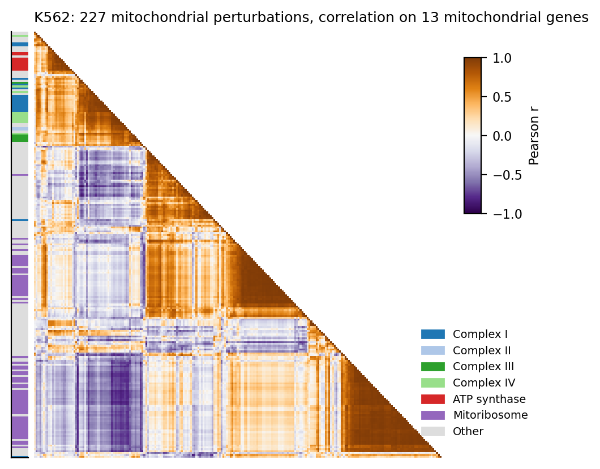{width=60%}

Fig. 13 shows the same perturbations compared on the mtDNA-encoded genes. Unlike the nuclear genome, the mitochondrial genome responds in a function-specific way: the heatmap breaks into blocks that correspond to the targeted complexes, and perturbations of the mitochondrial ribosome are anti-correlated with many others. Perturbations of the same complex are more alike on mtDNA genes than on nuclear genes for complexes III (mean r 0.86 against 0.69) and IV (0.84 against 0.51) and for ATP synthase (0.93 against 0.70).

Fig. 14 uses the expression of the mitochondrial genes as a phenotype in its own right. Each complex leaves a characteristic pattern: knockdown of mitoribosome subunits raises most mtDNA transcripts except those of complex IV, and knockdown of complex II and IV subunits raises MT-CO1 and MT-CO2. The pattern of TMEM242 knockdown matches that of ATP synthase subunits such as ATP5F1A and ATP5PO: on the 13 mtDNA genes it correlates with ATP synthase knockdowns at r = 0.90, against r = 0.46 with complex I knockdowns.

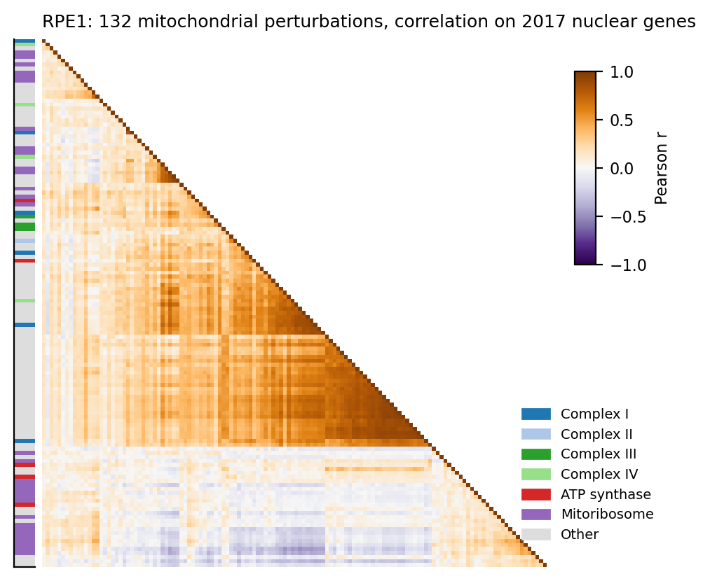{width=60%}

Fig. 15 shows the nuclear responses to the 132 mitochondrial perturbations in RPE1. As in K562, a large block of positively correlated perturbations dominates the heatmap, although the response is less uniform: within-complex correlations on nuclear genes are low in RPE1 (for example 0.07 for ATP synthase).

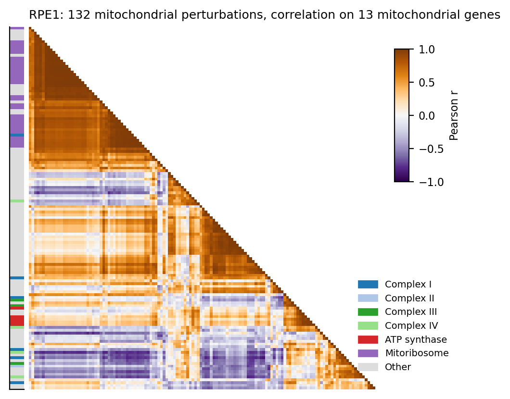{width=60%}

Fig. 16 shows the same RPE1 perturbations compared on the 13 mtDNA genes. As in K562, the mitochondrial genome responds in a function-specific way: perturbations of the mitochondrial ribosome (mean within-group r 0.86) and of ATP synthase (0.89) form tight blocks, so knockdown of different parts of the organelle leaves distinct mtDNA transcriptional fingerprints.

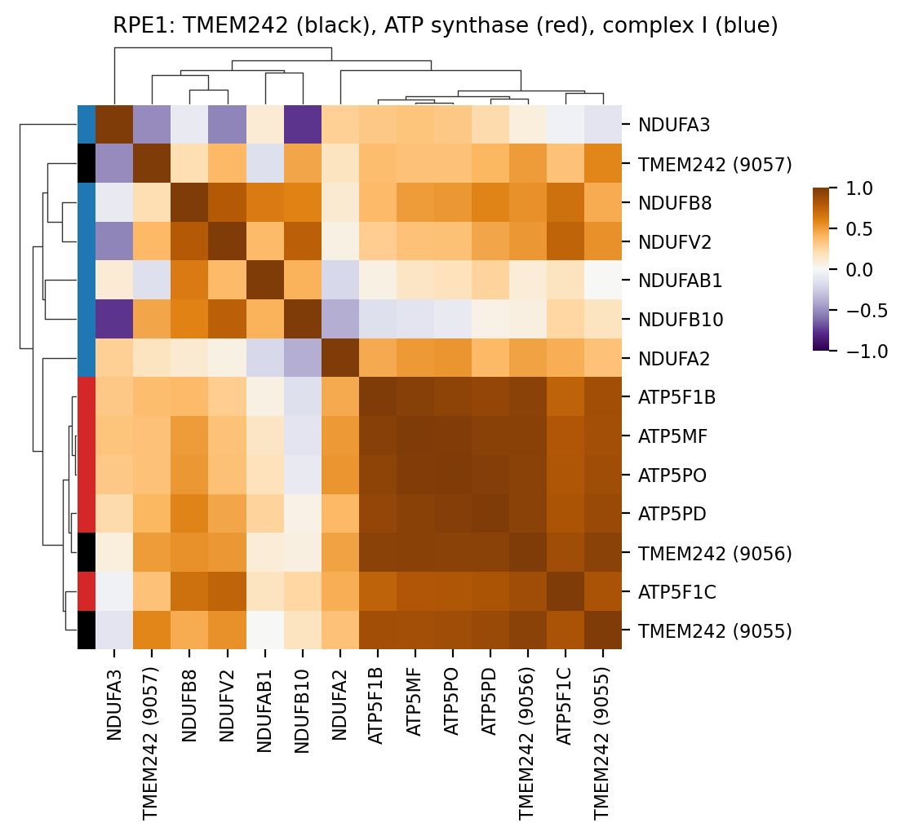{width=55%}

Fig. 17 repeats the TMEM242 analysis in RPE1. Two of the three sgRNA pairs targeting TMEM242 (9055 and 9056) cluster tightly with ATP synthase subunits (mean r 0.86 and 0.93) and are clearly separated from complex I (0.23 and 0.30). The third pair (9057) was measured in only 81 cells but changes 798 genes; it correlates only weakly with both groups (0.36 with ATP synthase and 0.09 with complex I), so its effect on mtDNA genes is dominated by a broader response.

# IV. New finding: the RNA exosome restrains histone and lncRNA/antisense transcripts

While examining the genotype-phenotype map of paper Fig. S5A, we noticed that a histone gene program and a program of dysregulated long non-coding RNA (lncRNA) and antisense transcripts responded to the same perturbations. Using the approach of section 7, we scored every perturbation for both programs (Fig. 18 top): the lncRNA/antisense signature is the gene expression program from section 6 that best matches this group (20 genes, including SNHG3, SNHG4, DANCR, MIR17HG and DLEU2), and the histone signature consists of the 15 replication-dependent histone genes expressed above 0.25 UMI per cell.

Many perturbations that raise one score also raise the other, and the most extreme of them target the RNA exosome: DIS3, EXOSC2, EXOSC3, EXOSC4, EXOSC5, EXOSC6, EXOSC8 and EXOSC9. The exosome is a conserved multi-subunit machine that degrades RNA from the 3' end [2]. Across all eleven exosome subunits in the screen, the median z-score is 27.0 for the lncRNA/antisense program and 6.7 for histone genes, against about 0 for all other perturbations (one-sided Mann-Whitney p = 5e-9 and 7e-9), and eight subunits rank among the top nine of 10,511 perturbations for the lncRNA/antisense score. Two subunits have much weaker effects: EXOSC10, the nuclear exonuclease, and EXOSC1, a cap subunit. The result agrees with earlier work showing that histone mRNAs and lncRNA/antisense transcripts are both degraded by the exosome [3][4]: when the exosome fails, both kinds of RNA persist longer. Other perturbations with high lncRNA/antisense scores include MTREX and ZFC3H1, which deliver nuclear RNAs to the exosome, supporting the same interpretation.

The two classes of RNA may be especially dependent on the exosome because both are short-lived: histone mRNAs are rapidly degraded at the end of S phase, and dysregulated lncRNA/antisense transcripts are aberrant products that are normally cleared by RNA quality control. We also note a hypothesis that these data cannot test: because histone gene expression is tightly regulated by chromatin, and lncRNA/antisense transcripts take part in this regulation, accumulating antisense transcripts could in principle feed back on histone gene transcription, for example by altering chromatin at histone gene promoters. Alternatively, the rise of histone mRNAs could be an indirect effect of exosome loss on the cell cycle.

To examine the perturbations more broadly, we took all perturbations with a score above 2.5 for either program (193 perturbations) and tested them for KEGG pathway enrichment against all scored perturbations (Fig. 18 bottom). RNA degradation, basal transcription factors, mRNA surveillance and RNA transport are enriched, consistent with the idea that loss of RNA degradation capacity drives the accumulation of these transcripts.

<figure> 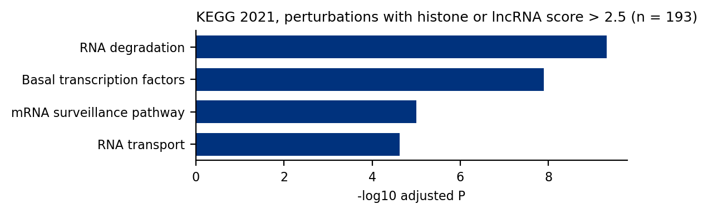<figcaption>Fig. 18. Top: lncRNA/antisense program score against histone gene score for all perturbations; exosome subunits in red, the 20 perturbations furthest from the origin labelled. Bottom: KEGG pathways enriched among perturbations with a score above 2.5 for either program; background, all scored perturbations.</figcaption></figure>

Mutations in exosome subunit genes cause several human diseases: EXOSC2 mutations are associated with retinitis pigmentosa, EXOSC3 mutations with pontocerebellar hypoplasia type 1 and spinal motor neuron disease, and EXOSC8 mutations with cerebellar and corpus callosum hypoplasia and spinal motor neuron disease [5]. Understanding which RNAs accumulate when the exosome fails may therefore help to explain how these diseases arise.

# V. Summary and outlook

This study reproduced the core genome-wide Perturb-seq analyses, including gene function annotation and the analysis of complex phenotypes, and the main results agree closely with the original paper (Table 1). The analysis confirms the strength of Perturb-seq for discovering gene function and regulatory mechanisms, and adds an observation on the shared regulation of histone and lncRNA/antisense transcripts by the RNA exosome.

| Result | This study | Paper |
|---|---|---|
| Strong perturbations, K562 genome-wide | 1,962 | 1,973 |
| Median r, same CORUM complex vs other pairs | 0.60 vs 0.10 | 0.61 vs 0.10 |
| Perturbation clusters | 63 | 63-64 |
| Agreement of perturbation correlations, K562 screens / K562 vs RPE1 | 0.83 / 0.33 | 0.82 / 0.37 |
| Gene expression programs | 39 | 38 |
| Mitochondrial perturbations, K562 / RPE1 | 227 / 132 | 268 / 140 |

Table 1. Main quantitative results compared with the paper.

There are several limitations. No experiments were done, so the proposed functions of new genes and the exosome hypothesis still need experimental confirmation. Three inputs differ from the paper: the genes used for clustering are an approximation of the paper's 2,319 genes, because per-gene test statistics are not public; CORUM 3.0 and MitoCarta3.0 were replaced by the CORUM library distributed by Enrichr and by GO annotations; and Fig. 5 compares correlation matrices with Pearson's r, whereas the paper used the cophenetic correlation. The clustering results depend on HDBSCAN settings, and about half of the genes and two-thirds of the strong perturbations are not assigned to any group. Future work could add proteomic and epigenomic data to build multi-omic genotype-phenotype maps and extend the analysis to more cell types and disease models.

# References

[1] Replogle JM, Saunders RA, Pogson AN, Hussmann JA, Lenail A, Guna A, Mascibroda L, Wagner EJ, Adelman K, Lithwick-Yanai G, Iremadze N, Oberstrass F, Lipson D, Bonnar JL, Jost M, Norman TM, Weissman JS. Mapping information-rich genotype-phenotype landscapes with genome-scale Perturb-seq. *Cell* 185, 2559-2575 (2022). https://doi.org/10.1016/j.cell.2022.05.013

[2] Zhang W, Zhu J, He X, Liu X, Li J, Li W, Yang P, Wang J, Hu K, Zhang X, Li X, Jing H. Exosome complex genes mediate RNA degradation and predict survival in mantle cell lymphoma. *Oncology Letters* (2019). https://doi.org/10.3892/ol.2019.10850

[3] Mullen TE, Marzluff WF. Degradation of histone mRNA requires oligouridylation followed by decapping and simultaneous degradation of the mRNA both 5' to 3' and 3' to 5'. *Genes & Development* 22, 50-65 (2008). https://doi.org/10.1101/gad.1622708

[4] Canavan R, Bond U. Deletion of the nuclear exosome component RRP6 leads to continued accumulation of the histone mRNA HTB1 in S-phase of the cell cycle in *Saccharomyces cerevisiae*. *Nucleic Acids Research* 35, 6268-6279 (2007). https://doi.org/10.1093/nar/gkm691

[5] Nair L, Chung H, Basu U. Regulation of long non-coding RNAs and genome dynamics by the RNA surveillance machinery. *Nature Reviews Molecular Cell Biology* 21, 123-136 (2020). https://doi.org/10.1038/s41580-019-0209-0
